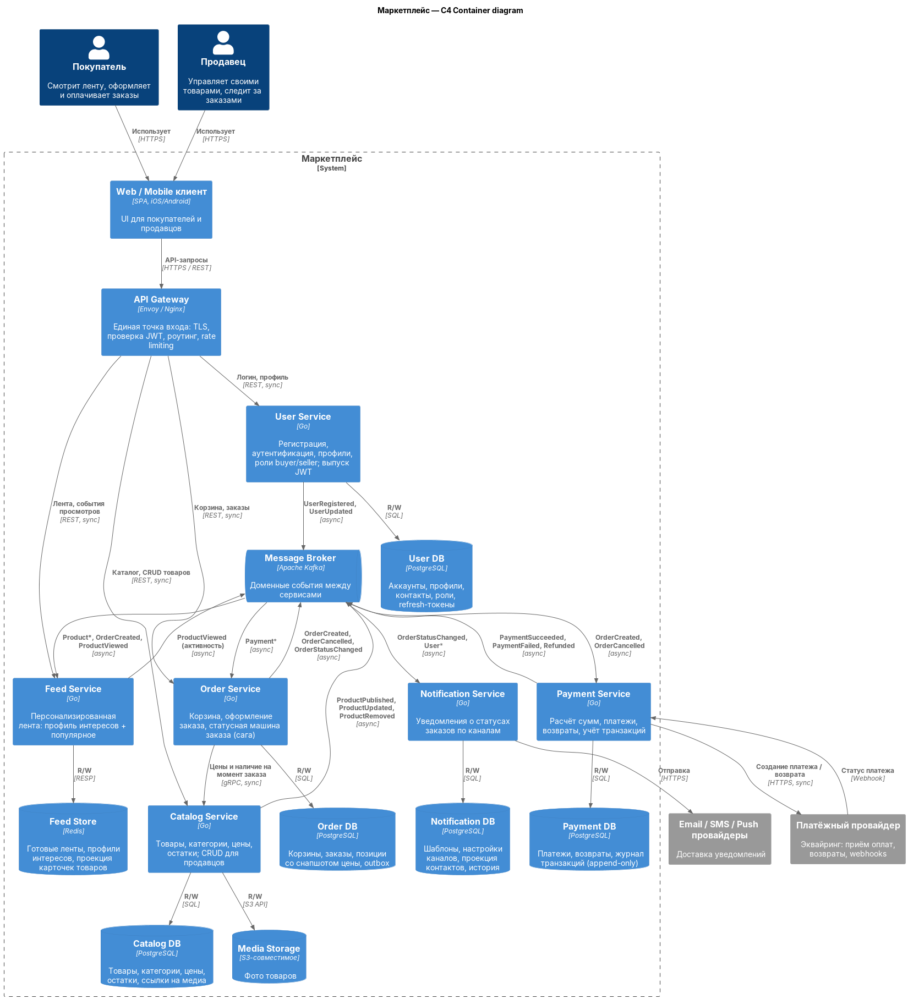

# Маркетплейс — архитектурное проектирование

ДЗ №1 Архитектурное проектирование системы маркетплейса

## 1. C4 Container-диаграмма




## Быстрый старт

Для Docker с Compose v2.

```bash
docker compose up -d --build
curl -i http://localhost:8080/health

Без Compose:

```bash
docker build -t catalog-service ./services/catalog-service
docker run --rm -p 8080:8080 catalog-service
```

## 2. Домены и зоны ответственности

| Домен | Зона ответственности |
|---|---|
| **Identity (пользователи)** | Регистрация и аутентификация покупателей и продавцов, профили, роли, выпуск JWT |
| **Catalog (каталог)** | Товары, категории, атрибуты, цены, остатки, медиа. Продавец управляет только своими товарами |
| **Feed (лента)** | Персонализированная выдача: профиль интересов пользователя, ранжирование|
| **Ordering (заказы)** | Корзина, оформление заказа, snapshot цены на момент покупки, статусная машина заказа |
| **Payments (платежи)** | Расчёт суммы к оплате, интеграция с платёжным провайдером, возвраты, журнал транзакций |
| **Notifications (уведомления)** | Доставка уведомлений о статусах заказов по email/SMS/push, шаблоны, настройки каналов |
---

## 3. Распределение доменов по сервисам

Требования я использовала как отправную точку, но каждый домен проверяла на то, что у него своя зона ответственности и свои данные. Например, «управление пользователями» могло распасться на два домена, отдельно для покупателей и продавцов. Но для обоих нужно одно и то же: регистрация, вход, профиль. Разница только в роли: у продавца есть право управлять своими товарами. При этом сами товары и проверка «это товар этого продавца» находятся в каталоге, а не в домене пользователей. Так как других данных для продавца тут не предполагалось, я не стала усложнять систему и оставила один домен. Хотя, конечно, в более сложной системе или реальном маркетплейсе этот домен стоило бы разделить на два. Похожая ситуация с «оформлением заказов» и «платежами». Их можно было объединить, но это разные вещи: заказ отвечает на вопрос «что купили», а платёж на «ну что там с деньгами». У одного заказа может быть несколько попыток оплаты и возврат. Кроме того, платежи работают через внешний провайдер, поэтому их лучше держать отдельно. Каталог и ленту я тоже разделила: каталог общий для всех список товаров, а лента — это подборка под конкретного пользователя на основе его поведения, то есть данные у них разные.

**Логика разбиения коротко:** границы сервисов совпадают с границами доменов (bounded contexts), потому что именно по ним различаются нагрузка, требования к надёжности и консистентности, частота изменений. Между доменами мало синхронных зависимостей, поэтому сетевая граница между ними обходится дёшево.

---

## 4. Границы владения данными

Правило: **у каждого сервиса своя БД, в чужую БД никто не ходит**. Чужие данные получаются только через API владельца или через события.

| Сервис | Владеет данными (источник правды) | Хранит проекцию чужих данных | Хранилище |
|---|---|---|---|
| User | Аккаунты, хэши паролей, профили, контакты, роли, refresh-токены | — | User DB (PostgreSQL) |
| Catalog | Товары, категории, цены, остатки, `seller_id` товара, фото товаров | — | Catalog DB (PostgreSQL) + Media Storage (S3) |
| Feed | Профили интересов, готовые ленты, счётчики популярности | Карточки товаров (из `Product*` событий) | Feed Store (Redis) |
| Order | Корзины, заказы, позиции **со снапшотом цены**, статусы, outbox | — (цену фиксирует в момент заказа) | Order DB (PostgreSQL) |
| Payment | Платежи, возвраты, журнал транзакций (append-only), idempotency-ключи | Сумма и id заказа (из `OrderCreated`) | Payment DB (PostgreSQL) |
| Notification | Шаблоны, настройки каналов, история отправок | Контакты пользователей (из `User*` событий) | Notification DB (PostgreSQL) |

---

## 5. Взаимодействие сервисов

### Синхронное

| Кто → кому | Протокол | Зачем | Почему sync |
|---|---|---|---|
| Приложение покупателя → API Gateway | HTTPS/REST | Лента, каталог, корзина, заказы | Пользователь ждёт ответа |
| Кабинет продавца → API Gateway | HTTPS/REST | Управление товарами, заказы магазина | Пользователь ждёт ответа |
| Gateway → User / Catalog / Feed / Order | REST | Роутинг запросов | Пользователь ждёт ответа |
| Order → Catalog | gRPC | Актуальные цена и наличие при оформлении заказа | Нельзя оформить заказ по устаревшей цене — нужен ответ здесь и сейчас |
| Payment → Платёжный провайдер | HTTPS | Создать платёж / возврат | API провайдера синхронное |
| Платёжный провайдер → Payment | Webhook | Итоговый статус платежа | Провайдер сам сообщает результат |
| Notification → Email/SMS/Push | HTTPS | Отправка сообщений | API провайдеров синхронное; ретраи внутри Notification |

### Асинхронное (Kafka)

| Событие | Публикует | Подписчики | Зачем |
|---|---|---|---|
| `UserRegistered`, `UserUpdated` | User | Notification | Проекция контактов для рассылок |
| `ProductPublished`, `ProductUpdated`, `ProductRemoved` | Catalog | Feed | Проекция карточек, пересчёт лент |
| `ProductViewed` | Feed | Feed | Сырые события активности → профиль интересов |
| `OrderCreated` | Order | Payment, Feed | Запуск оплаты; сигнал для персонализации |
| `OrderCancelled` | Order | Payment | Возврат, если оплата уже прошла |
| `OrderStatusChanged` | Order | Notification | Уведомление покупателя |
| `PaymentSucceeded`, `PaymentFailed`, `Refunded` | Payment | Order | Перевод заказа в следующий статус |

Вне рамок системы: логистика, склад, доставка.

---

## 6. Альтернативные варианты декомпозиции

### Вариант A — модульный монолит

Одно приложение, внутри модули по тем же доменам с явными интерфейсами между ними. Одна PostgreSQL, у каждого модуля своя схема. Ленты кешируются в Redis.

### Вариант B — микросервисы «домен = сервис» (это вариант и выбран)

Описан выше: 6 доменных сервисов, у каждого своя БД, sync для запросов пользователя, async-события для процессов между доменами.

### Вариант C — крупные сервисы по группам доменов

Три сервиса:
- **Commerce** = каталог + заказы + платежи (одна БД);
- **Customer** = пользователи + уведомления;
- **Discovery** = лента.
---
